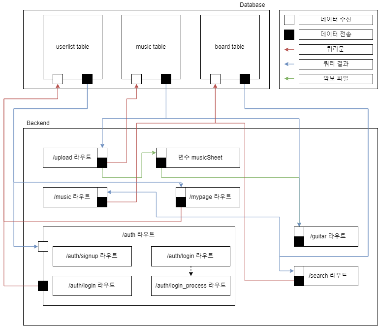

# 기타 반주기 웹 어플리케이션

## 1. 프로젝트 정보

### (1) 프로젝트 요약

기타 반주기 웹 어플리케이션이란 웹 상에서 기타 악보를 그리고 그에 맞는 반주를 재생하는 프로그램이다.

본 프로그램은 게시판에서 여러 곡들을 찾아볼 수 있으며, 각 음악의 기타 반주를 들으며 기타를 연습할 수 있다.

기타 프로(Guitar Pro) 파일을 웹 페이지에 업로드 함으로써 곡을 추가할 수 있고 해당 파일을 다른 사용자와 공유할 수 있다

로그인 한 회원만 업로드 할 수 있다.

### (2) 팀원 정보

* Guardian_demoN
* Lai_Khan

### (3) 개발 동기

기타를 혼자 연습하다 보면 불편한 점이 많다. 악보를 직접 넘겨가면서 연습해야 하고, 박자를 정확히 맞추기가 어렵다. 그래서 "기타 반주기 프로그램을 사용할 수 있다면 연습하기 편할텐데" 라는 생각이 들었다. 그래서 기타를 연습하기 편하게 악보를 한눈에 보여주고 박자를 알 수 있도록 반주를 재생해 주는 기타 반주기 프로그램을 개발하고 싶었다. 또한, 누구나 사용할 수 있도록 웹 어플리케이션으로 만들고 싶었다.

## 2. 프로젝트 내용

### (1) 구성도

</img>

### (2) 주요 기능 및 설명

1. 악보 표현/재생 기능

   사용자는 웹페이지에서 다양한 음악의 악보를 조회할 수 있고, 시각적으로 확인할 수 있으며, 재생하는 과정을 통해 반주를 직접 들을 수 있다.
2. 회원 기능

   사용자는 웹페이지에서 회원가입을 할 수 있으며, 로그인을 통해 원하는 악보를 업로드 할 수 있다.
3. 게시판 및 검색 기능

   사용자는 웹사이트에 업로드된 악보들을 조회할 수 있으며, 게시물 이름이나 업로더의 이름을 통해 게시물을 검색할 수 있다.
4. 업로드 기능

   상기한 회원제 기능을 통해 로그인한 회원은 자신이 가지고 있는 기타 악보 파일을 웹페이지에 업로드할 수 있다.

### (3) 파일 및 디렉토리
```
📁GuitarMusicDevice
├ㅡㅡ 📁bin
|    ├ㅡ 📝www
├ㅡㅡ 📁lib
|    ├ㅡ 📝mysql.js
├ㅡㅡ 📁node_modules
├ㅡㅡ 📁public
|    ├ㅡ 📁files
|    ├ㅡ 📁fonts
|    ├ㅡ 📁html
|    ├ㅡ 📁images
|    ├ㅡ 📁javascripts
|    ├ㅡ 📁stylesheets
├ㅡㅡ 📁routes
|    ├ㅡ 📝about.js
|    ├ㅡ 📝auth.js
|    ├ㅡ 📝guitar.js
|    ├ㅡ 📝index.js
|    ├ㅡ 📝music.js
|    ├ㅡ 📝mypage.js
|    ├ㅡ 📝search.js
|    ├ㅡ 📝upload.js
├ㅡㅡ 📁views
├ㅡㅡ 📝app.js
├ㅡㅡ 📝package-lock.json
└ㅡㅡ 📝package.json
```

## 3. 프로젝트 수행

### (1) 팀원 별 역할

__Guardian_demoN__
* 회원가입 기능 구현
  - 폼 데이터 빈칸 검사 구현
  - 데이터 적합성 검사 구현
  - SHA256 암호를 통한 회원정보 관리 구현
  - 데이터베이스 연동 및 로그인 기능 구현
* 악보 파일 업로드 기능 구현
  - 파일 확장자 검사 기능 구현
  - 모듈을 이용한 파일 업로드 기능 구현

__Lai_Khan__
* 오픈소스 관련 기능 구현
  - 적합한 오픈소스 탐색 및 선정
  - 오픈소스 연동 악보 표현 기능 구현
* 게시판 및 검색 기능 구현
  - 게시판 및 페이지 기능 구현
  - 게시판 내 악보 검색 기능 구현
* 웹페이지 구현 및 배포
  - HTML과 CSS 프레임워크 Bulma를 이용한 프론트엔드 구현
  - AWS Lightsail을 이용한 웹페이지 배포 및 도메인 연결
* 프로젝트 관리
  - 프로젝트 버전 및 일정 관리
  - 웹페이지 라우팅 설계

### (2) 개발 환경

- 프론트엔드 : HTML, CSS, Javascript, jQuery
- 백엔드 : Node.js, Express, MySQL
- 배포 : AWS Lightsail

## 4. 결과

</img>

http://www.fortebguitar.com/
